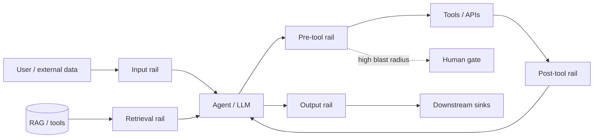

# Guardrail taxonomy (agentic systems)

A **guardrail** is a runtime policy layer between an agent and the world. Every check returns one of four decisions:

> **allow · block · rewrite · escalate-to-human**

This taxonomy is the map for later phases (input rail → retrieval rail → tool rails → output rail → human gates).

## By placement in the pipeline

| Type | When it runs | What it governs |
|------|----------------|-----------------|
| **Input validation** | Before the model/agent sees user content | Injection, jailbreaks, schema, length, topic allow/deny |
| **Dialog / topical rails** | Across turns | Stay on-topic, refuse off-scope requests, multi-turn policy |
| **Retrieval rails** | After fetch, before context injection | Poisoned RAG chunks, tool results, web pages (indirect injection) |
| **Tool-call rails (pre-execution)** | Before a tool/API runs | Name allowlist, param schema, scope, authorization |
| **Tool-call rails (post-execution)** | After tool returns, before re-entry to context | Untrusted tool output, secrets in results, injection in payloads |
| **Output validation** | Before response or downstream sinks | Toxicity, secrets, groundedness, structured output |
| **Output sanitization** | Before SQL/HTML/shell/email | Second-order injection from model text |
| **PII detection / redaction** | Input, state, or output boundaries | Detect, redact, or reversible tokenization |
| **Scope / authority enforcement** | Tool and data paths | Least privilege, role boundaries, “this agent may only…” |
| **Budget / rate caps** | Per run, per user, per tenant | Tokens, cost, API calls, action count |
| **Loop / anomaly detection** | During agent loop | Repeated tools, oscillation, trajectory drift |
| **Audit / observability** | All of the above | “Blocked by policy X at time T” — compliance and tuning |

## Architectural fork (preview of Phase 7)

| Approach | Where policy lives | Strength | Weakness |
|----------|-------------------|----------|----------|
| **Application-level** | Inside your LangGraph / service | Fine-grained, domain-aware | Inconsistent across many agents |
| **Gateway / centralized** | Policy layer on every model/tool call | Consistent enforcement, audit | Latency, ownership, chokepoint design |

Most production systems **layer both**: gateway for baseline controls, in-graph rails for blast-radius and domain policy.

## Mental model

No single rail covers the full OWASP surface — **compose** layers and map each risk explicitly (see [owasp-to-guardrail-mapping.md](./owasp-to-guardrail-mapping.md)).
